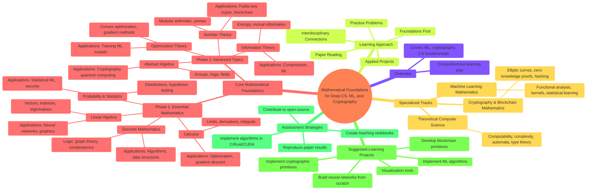

# Deep Compute Labs

## Overview

Educational repository for deep CS, ML, Cybersec.

## Requirements

- **C**: GCC or another C compiler
- **Rust**: Rust compiler and cargo (install from https://rustup.rs/)
- **Assembly**: NASM assembler and ld linker
- **CUDA**: NVIDIA CUDA Toolkit and compatible GPU

## Confirm setup

### C

```bash
gcc --version
gcc hello/C/hello.c -o hello/bin/C
./hello/bin/C
```

### Rust

```bash
rustc --version
cargo --version
rustc hello/rust/hello.rs -o hello/bin/rust
./hello/bin/rust
```

### Assembly

```bash
as --version
ld --version
as hello/assembly/hello.s -o hello/assembly/hello.o
ld hello/assembly/hello.o -o hello/bin/assembly
./hello/bin/assembly
```

### CUDA

```bash
nvcc --version
nvidia-smi
nvcc hello/cuda/hello.cu -o hello/bin/cuda
./hello/bin/cuda
```


## Theory roadmap

