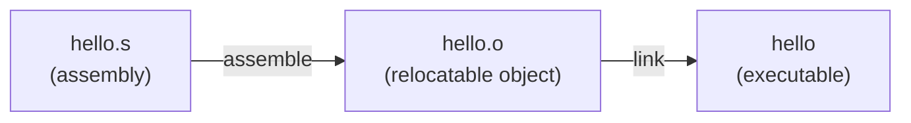
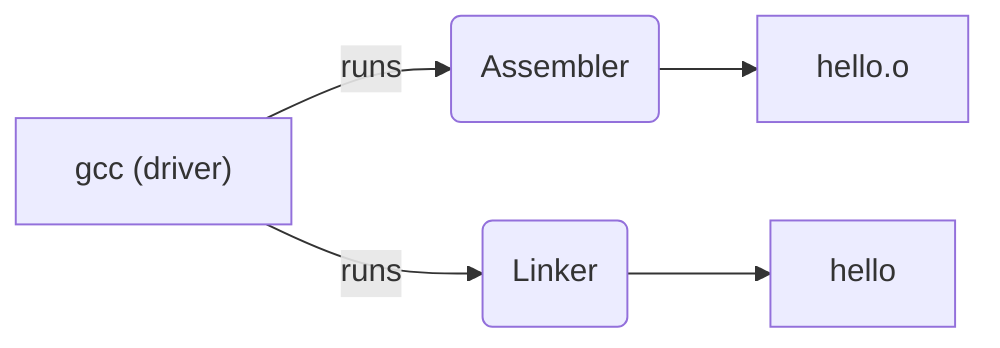
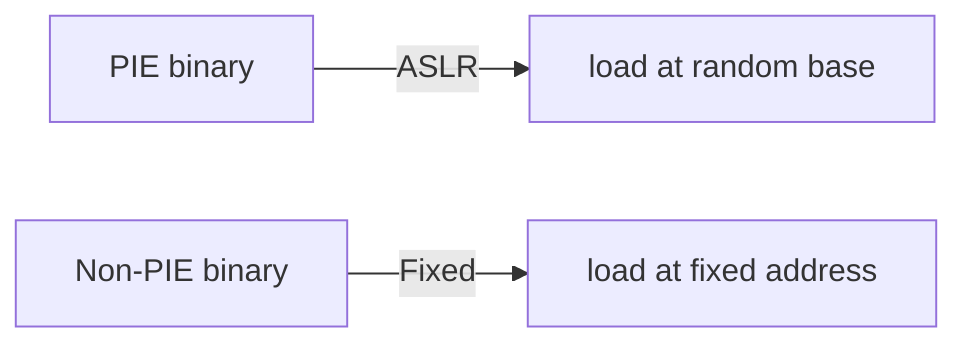

# system/asm — Assembly Labs
---

## Quick start — assembling and running examples (x86-64 Linux)

### 1) Using GNU `as` + `ld` (recommended for `.s` GAS/AT&T files)

From the workspace root, run:

```bash
# assemble and link the example
as hello/assembly/hello.s -o hello/assembly/hello.o
ld hello/assembly/hello.o -o hello/bin/hello_as

# run
./hello/bin/hello_as
```

Notes:
- The sample `hello.s` uses direct syscalls for Linux x86_64. If you see relocation errors, link with `-dynamic-linker` or use `gcc` as the linker driver instead.

### 2) Using `gcc` to assemble and link

`gcc` is convenient because it handles linking flags and PIE modes for you:

```bash
# Assemble and link in one step
gcc -no-pie -o hello/bin/hello_gcc hello/assembly/hello.s
./hello/bin/hello_gcc
```

If your toolchain supports PIE by default, `-no-pie` forces a non-position-independent binary and avoids `_start` label differences.

### 3) Using NASM (Intel syntax)

You may prefer Intel syntax and `nasm`:

```nasm
; hello.nasm (Intel syntax)
section .data
    msg db "Hello, World!", 10
    len equ $ - msg

section .text
    global _start

_start:
    mov rax, 1
    mov rdi, 1
    mov rsi, msg
    mov rdx, len
    syscall

    mov rax, 60
    xor rdi, rdi
    syscall
```

Assemble and link with:

```bash
nasm -felf64 hello/assembly/hello.nasm -o hello/assembly/hello_nasm.o
ld hello/assembly/hello_nasm.o -o hello/bin/hello_nasm
./hello/bin/hello_nasm
```

## Understanding the build pipeline ✅

This section briefly explains how a `.s` (assembly) source becomes a runnable binary and what the intermediate `.o` file contains.

### 1) Assemble: `.s` -> `.o`
- The assembler (GNU `as` or `nasm`) takes your assembly text and emits machine code into an object file (.o). It organizes code and data into ELF sections such as `.text` and `.data`, includes a symbol table, and writes relocation records for any addresses not yet known.



### 2) The `.o` file (relocatable object)
- It's an ELF relocatable object: code/data sections + symbol table + relocation entries. Addresses inside are relative and unresolved linkage points are recorded for the linker to fix.
- You can inspect `.o` with tools like `readelf -S`, `readelf -s`, and `objdump -d`.

### 3) Link: `.o` -> executable
- The linker (GNU `ld`, or `gcc` driver) combines objects and libraries, resolves external symbols, applies relocations (patches addresses), and produces a final ELF executable or shared object.
- If you link by hand with `ld`, you must supply the correct CRT startup objects and library paths; otherwise you'll see relocation or missing symbol errors.

## Why `gcc` is convenient 🔧
- `gcc` is a driver that calls the assembler and linker with sensible defaults and adds runtime/startup objects when needed.
- When you use `gcc` to link a C or assembly file:
  - It automatically adds startup objects (e.g., `crt1.o`) and the correct `dynamic-linker` entry for dynamically linked binaries.
  - It adds the standard libraries (libc, libgcc) and LDFLAGS appropriate for your distribution and toolchain.
  - It handles PIE (position-independent executable) defaults and many other flags for you; use `-no-pie` for non-PIE behavior if you want direct `_start` semantics.



## PIE (Position-Independent Executable) — what's that? ⚠️
- PIE executables are built in a way that allows the OS to load them at a randomized base address (ASLR). This helps security by preventing attackers from predicting where code lives in memory.
- When PIE is enabled (default on many modern distros), the linker produces an executable where relative addressing or relocations are performed so the loader can place the program at a randomized base.
- That means any assembly that expects fixed addresses (e.g., using an absolute label address or assuming `_start` is at a fixed address) may behave differently; adding `-no-pie` instructs the toolchain to build a non-PIE binary with fixed load addresses.



### Quick tips 💡
- If you get relocation or undefined symbol errors when using `ld` directly, try using `gcc` as the linker driver: `gcc -o hello hello.o` or to avoid PIE: `gcc -no-pie -o hello hello.s`.
- Inspect objects with `readelf` and `objdump` to understand sections, symbols, and relocations.

