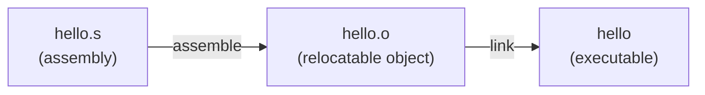
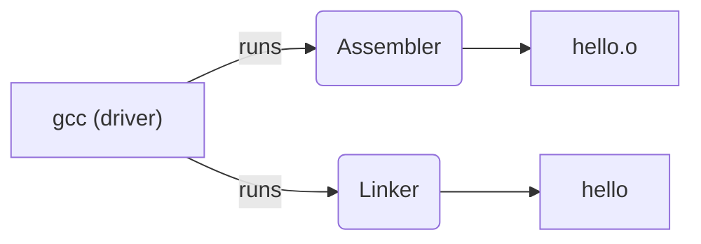
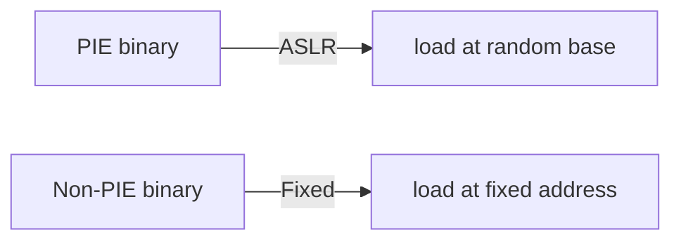

# system/asm — Assembly Labs
---

## Quick start — assembling and running examples (x86-64 Linux)

### 1) Using GNU `as` + `ld` (recommended for `.s` GAS/AT&T files)

From the workspace root, run:

```bash
# assemble and link the example
as hello/assembly/hello.s -o hello/assembly/hello.o
ld hello/assembly/hello.o -o hello/bin/hello_as

# run
./hello/bin/hello_as
```

Notes:
- The sample `hello.s` uses direct syscalls for Linux x86_64. If you see relocation errors, link with `-dynamic-linker` or use `gcc` as the linker driver instead.

### 2) Using `gcc` to assemble and link

`gcc` is convenient because it handles linking flags and PIE modes for you:

```bash
# Assemble and link in one step
gcc -no-pie -o hello/bin/hello_gcc hello/assembly/hello.s
./hello/bin/hello_gcc
```

If your toolchain supports PIE by default, `-no-pie` forces a non-position-independent binary and avoids `_start` label differences.

### 3) Using NASM (Intel syntax)

You may prefer Intel syntax and `nasm`:

```nasm
; hello.nasm (Intel syntax)
section .data
    msg db "Hello, World!", 10
    len equ $ - msg

section .text
    global _start

_start:
    mov rax, 1
    mov rdi, 1
    mov rsi, msg
    mov rdx, len
    syscall

    mov rax, 60
    xor rdi, rdi
    syscall
```

Assemble and link with:

```bash
nasm -felf64 hello/assembly/hello.nasm -o hello/assembly/hello_nasm.o
ld hello/assembly/hello_nasm.o -o hello/bin/hello_nasm
./hello/bin/hello_nasm
```

## Understanding the build pipeline ✅

This section briefly explains how a `.s` (assembly) source becomes a runnable binary and what the intermediate `.o` file contains.

### 1) Assemble: `.s` -> `.o`
- The assembler (GNU `as` or `nasm`) takes your assembly text and emits machine code into an object file (.o). It organizes code and data into ELF sections such as `.text` and `.data`, includes a symbol table, and writes relocation records for any addresses not yet known.



### 2) The `.o` file (relocatable object)
- It's an ELF relocatable object: code/data sections + symbol table + relocation entries. Addresses inside are relative and unresolved linkage points are recorded for the linker to fix.
- You can inspect `.o` with tools like `readelf -S`, `readelf -s`, and `objdump -d`.

### 3) Link: `.o` -> executable
- The linker (GNU `ld`, or `gcc` driver) combines objects and libraries, resolves external symbols, applies relocations (patches addresses), and produces a final ELF executable or shared object.
- If you link by hand with `ld`, you must supply the correct CRT startup objects and library paths; otherwise you'll see relocation or missing symbol errors.

## Why `gcc` is convenient 🔧
- `gcc` is a driver that calls the assembler and linker with sensible defaults and adds runtime/startup objects when needed.
- When you use `gcc` to link a C or assembly file:
  - It automatically adds startup objects (e.g., `crt1.o`) and the correct `dynamic-linker` entry for dynamically linked binaries.
  - It adds the standard libraries (libc, libgcc) and LDFLAGS appropriate for your distribution and toolchain.
  - It handles PIE (position-independent executable) defaults and many other flags for you; use `-no-pie` for non-PIE behavior if you want direct `_start` semantics.



## PIE (Position-Independent Executable) — what's that? ⚠️
- PIE executables are built in a way that allows the OS to load them at a randomized base address (ASLR). This helps security by preventing attackers from predicting where code lives in memory.
- When PIE is enabled (default on many modern distros), the linker produces an executable where relative addressing or relocations are performed so the loader can place the program at a randomized base.
- That means any assembly that expects fixed addresses (e.g., using an absolute label address or assuming `_start` is at a fixed address) may behave differently; adding `-no-pie` instructs the toolchain to build a non-PIE binary with fixed load addresses.



### Quick tips 💡
- If you get relocation or undefined symbol errors when using `ld` directly, try using `gcc` as the linker driver: `gcc -o hello hello.o` or to avoid PIE: `gcc -no-pie -o hello hello.s`.
- Inspect objects with `readelf` and `objdump` to understand sections, symbols, and relocations.

## CPU execution modes on x86 — Real, Protected, Long mode ⚙️

The x86 architecture supports several CPU execution modes. At reset the CPU starts in 16-bit "real mode" and firmware (BIOS/UEFI) typically runs before loading a bootloader or kernel. A bootloader can switch the CPU into Protected mode (32-bit), and then into Long mode (64-bit). Many userland and kernel expectations change between modes.

```mermaid
flowchart LR
    Reset[CPU Reset] --> Real[Real mode (16-bit)]
    Real --> BIOS[Bios/UEFI]
    BIOS --> Bootloader[Bootloader
go to protected/long mode]
    Bootloader --> Protected[Protected mode (32-bit)]
    Protected --> Long[Long mode (64-bit)]
    Long --> Kernel[Kernel (64-bit)]
    Kernel --> Userland[Userland (64-bit)]
```

Brief differences and common instruction examples per mode:

- Real mode (16-bit): small memory model, segmentation-based addressing, BIOS interrupts available.
    - Common instructions: far/jump & call, `int 0x10` (BIOS video), `mov ax,`/`bx`/`si`, `in`/`out` (I/O ports), `cli`/`sti`, `hlt`.
    - Example (GAS/AT&T):
        ```asm
        .code16
        mov $0x3f8, %dx  # ttyS0 port
        mov $'A', %al
        out %al, %dx
        int $0x10         # BIOS video interrupt
        cli
        hlt
        ```

- Protected mode (32-bit): flat addressing (if set up), 32-bit registers, interrupts still available; switch via `lgdt` + set CR0.PE + `ljmp` to flush prefetch.
    - Common instructions: `lgdt`, `mov` to control registers (CR0), far jumps (`ljmp`), `int 0x80` (Linux 32-bit syscall), `in`/`out`.
    - Example (GAS/AT&T):
        ```asm
        # set up GDT, enable protected mode (sketch)
        lgdt [gdt_descriptor]
        movl %cr0, %eax
        orl $0x1, %eax        # set PE bit
        movl %eax, %cr0
        ljmp $selector, $offset
        ```

- Long mode (64-bit): 64-bit register set (RAX..R15), RIP-relative addressing, syscalls via `syscall`/`sysret`. Must enable PAE and long mode via MSRs, enable paging and jump into 64-bit entry.
    - Common instructions: `mov` with r64 registers, `syscall`/`sysret`, `lea` with RIP-relative displacement, `wrmsr`/`rdmsr` used by firmware/bootloader to set EFER.
    - Example (GAS/AT&T):
        ```asm
        .intel_syntax noprefix
        mov rax, 1
        mov rdi, 1
        lea rsi, [rip + msg]
        mov rdx, len
        syscall              # write to stdout on syscall ABI
        ```

Notes and practical considerations:
- QEMU and real hardware both boot in real mode by default; the firmware (SeaBIOS) runs and typically loads a bootloader which switches modes.
- You won't be able to directly execute 64-bit instructions by just writing a 64-bit binary into physical memory on a fresh CPU—switching to long mode requires privileged steps.
- `int 0x80` is a Linux 32-bit syscall convention; modern 64-bit Linux uses `syscall` and a different calling convention (arg0..arg5 in rdi..r9). For small experiments, use the 16-bit or 64-bit examples that match the CPU mode.


## Assembly syntax: AT&T vs Intel (GAS vs NASM)

This project supplies both GAS/AT&T (`.s`) examples and NASM/Intel (`.nasm`) samples. Both are valid for x86-64, but they use different textual conventions; knowing both helps when reading examples and debugging toolchain behavior.

### Key differences
- Operand order:
    - AT&T: source, destination (e.g., `movq %rax, %rbx` → rbx ← rax)
    - Intel: destination, source (e.g., `mov rbx, rax` → rbx ← rax)
- Register/immediate prefixes:
    - AT&T: registers use `%` (e.g., `%rax`) and immediates use `$` (e.g., `$1`).
    - Intel: no `%`/`$` prefixes (e.g., `rax`, `1`).
- Size suffixes and directives:
    - AT&T: mnemonics often use suffixes `b/w/l/q` to indicate operand size (e.g., `movb`, `movq`), and directives like `.text`, `.data`, `.globl`.
    - Intel (NASM): size is implied by the operand form, and directives are `section .text`, `section .data`, `global` and `db`/`dq` etc.
- Memory addressing:
    - AT&T: `disp(base, index, scale)` e.g., `8(%rbp)`, `(%rax,%rcx,4)`.
    - Intel: `[base + index*scale + disp]` e.g., `[rbp + 8]`, `[rax + rcx*4]`.

### Short examples (Linux x86-64 write syscall)
AT&T / GAS:
```asm
        movq $1, %rax
        movq $1, %rdi
        lea msg(%rip), %rsi
        movq $len, %rdx
        syscall
```

NASM / Intel:
```nasm
        mov rax, 1
        mov rdi, 1
        mov rsi, msg
        mov rdx, len
        syscall
```

### Useful directives and tools
- Sections: `.text`, `.data`, `.rodata`, `.bss` (GAS) and `section .text`, `section .data` (NASM).
- Data directives: `.byte/.word/.long/.quad` (GAS) and `db/dw/dd/dq` (NASM).
- Symbol export: `.globl` (GAS) / `global` (NASM).
- Use `objdump -d -Mintel` or `.intel_syntax noprefix` in GAS if you prefer Intel syntax while staying in the GAS toolchain.

### References
- GNU Assembler manual: https://sourceware.org/binutils/docs/as/
- NASM manual: https://www.nasm.us/doc/
- Intel SDM (ISA reference): https://www.intel.com/content/www/us/en/developer/articles/technical/intel-sdm.html
- System V AMD64 ABI: https://refspecs.linuxfoundation.org/elf/x86_64-abi-0.99.pdf
- AT&T vs Intel syntax summary: https://en.wikipedia.org/wiki/X86_assembly_language#Syntax
- Instruction reference (quick): https://www.felixcloutier.com/x86/

### Resolution — which syntax to prefer? ✅
For a multi-architecture learning pathway (x86 plus non-Intel architectures like ARM or RISC-V), here's a practical guideline:

- Prioritise understanding architecture-agnostic concepts first: registers, addressing modes, calling conventions, and how toolchains assemble, link, and load programs. Syntax is a surface layer—concepts carry across architectures.
- If you want a single default for this repo and Linux-targeted labs, prefer **GAS / AT&T** (the default for GNU toolchains). Reasons:
    - It's the GNU assembler default and integrates with GCC/ld workflows used throughout these labs.
    - Many OS-level and kernel examples, as well as distribution toolchains, use GAS by default.
    - Using GAS keeps the command-line toolchain and tutorial examples consistent across architectures that use the GNU tools.
- If learning readability and quick experimentation is your top priority, **Intel / NASM** is often easier for newcomers (destination-first order). You can still use NASM for isolated examples and switch to GAS for low-level toolchain and distro-native builds.
- Best practice: learn both syntaxes (or at least how to read both). Also practice switching using `.intel_syntax noprefix` with GAS or using `objdump` with `-Mintel` / `-Mat&t` to inspect output.

By adopting GAS/AT&T as the canonical syntax for the labs while exposing Intel/NASM examples, learners get the best of both worlds: toolchain compatibility and readable examples.

## Examples: side-by-side (short, annotated)
Here are a few small examples showing common instructions and addressing in both syntaxes. These demonstrate identical behaviour, just different textual conventions.

1) Move immediate to register

```asm
// AT&T (GAS)
    movq $1, %rax   # rax = 1

// Intel (NASM)
    mov rax, 1      ; rax = 1
```

2) Load from stack (base + displacement)

```asm
// AT&T (GAS)
    movq -8(%rbp), %rax  # load qword at rbp-8 -> rax

// Intel (NASM)
    mov rax, [rbp-8]     ; load qword at rbp-8 -> rax
```

3) Load address (RIP-relative and LEA)

```asm
// AT&T (GAS)
    lea msg(%rip), %rsi   # rsi = address of msg

// Intel (NASM)
    lea rsi, [rip + msg]  ; rsi = address of msg
```

### Quick notes
- The instructions are the same; the textual differences are operands order, prefixes, and memory address notation.
- When disassembling, `objdump -d -Mintel` will show Intel syntax if you prefer it.

```bash
# show disassembly in Intel syntax
objdump -d -Mintel hello/assembly/hello.o
```

## Switch GAS to Intel style (if you prefer Intel syntax) 🔁
GAS supports an Intel-like syntax mode. Add the directive at the top of a `.s` file and use Intel-style instructions without `%`/$ prefixes:

```asm
.intel_syntax noprefix
.section .text
.global _start
_start:
    mov rax, 1
    mov rdi, 1
    mov rsi, msg
    mov rdx, len
    syscall
```

Mermaid diagram (concept):


⚠️ Note: `.intel_syntax noprefix` tells the assembler to parse Intel-like syntax; it does not make your code NASM-compatible — NASM and GAS still use different directive sets.

## ARM / RISC-V — short note for multi-arch learners
If you plan to learn architectures beyond x86, here are a few short pointers:

- ARM has a distinct assembly language and register set (e.g., `r0`..`r12` for ARMv7 or `x0`..`x30` for AArch64). ARM uses different calling conventions, instruction sets (ARM vs Thumb), and assembler directives. Typical assemblers include `as`/`gcc` for ARM or `clang` builtins.
- RISC-V is a newer, simple RISC ISA. GNU toolchain support is available (`riscv64-unknown-elf-gcc`, `as`, `objdump`). RISC-V assembly uses `x0`..`x31` register names or ABI names like `a0`..`a7`, `t0`..`t6`.
- For both ARM and RISC-V, there is no AT&T / Intel syntax debate — the syntax is native to the ISA and the assembler you use.

References / docs for ARM and RISC-V:
- ARM Architecture Manuals: https://developer.arm.com/documentation
- AArch64 (ARMv8-A) ABI and manuals: https://developer.arm.com/documentation/100069/0001
- RISC-V specifications: https://riscv.org/specifications/
- RISC-V GNU Toolchain: https://github.com/riscv/riscv-gnu-toolchain

### Practical advice
- If you're going multi-arch, learn to read assembly idioms for each ISA and focus on architecture-agnostic concepts (calling conventions, syscalls, memory model). Use `gcc`/`as` for platform-native examples and the appropriate cross-toolchain when experimenting with non-x86 architectures.


