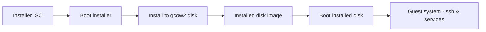

# system/emulation — Device Emulation and Kernel Testing

This document covers how device emulation works in QEMU, how to configure emulated devices for testing (especially pre-kernel/bare-metal code), how to monitor device interactions and guest physical memory, and how to install and test a Linux kernel on an emulated machine.

Quick notes:
- This guide uses `qemu-system-x86_64` for x86_64 examples; similar options exist for other architectures (e.g., `qemu-system-arm`, `qemu-system-riscv64`).
- Where possible, commands show minimal, copy-paste-ready examples.

---

## Overview: How device emulation works 🔧

- QEMU emulates an entire machine (CPU, memory, and devices) in software and can accelerate execution using KVM on Linux hosts.
- Devices are modelled as emulated hardware (e.g., NICs, storage, serial ports). Each device is exposed to the guest through a common bus (PCI, ISA, MMIO regions).
- You can attach a raw binary, an ELF image, or a full kernel image to the emulated machine. QEMU provides multiple ways to load these images into guest physical memory or use them as block devices.


Key concepts:
- Guest physical address: the physical addresses inside the emulated guest machine (useful when testing OS/kernel code).
- Virtual addresses: addresses produced by the guest's MMU after translation.
- QEMU device loaders (e.g., `-kernel`, `-initrd`, `-device loader`, `-drive`) let you place code/data in guest physical memory or in a disk image.

---

## Basic QEMU options to know

- `-kernel <file>`: load a kernel image (usually a Linux `bzImage`) into memory and start it.
- `-initrd <file>`: load an initial RAM disk (initramfs cpio.gz) passed to the kernel.
- `-append "<cmdline>"`: append kernel command-line arguments.
- `-drive file=,format=qcow2,if=virtio`: attach a disk image.
- `-device <device>`: add a specific hardware device, e.g., `-device e1000,netdev=net0` or `-device virtio-blk,drive=hd0`.
- `-netdev user,id=net0,hostfwd=tcp::2222-:22`: user-mode network with port forwarding for SSH.
- `-serial mon:stdio` or `-nographic`: redirect guest serial console to the host terminal.
- `-monitor stdio`: use QEMU monitor in stdio (can conflict with `-serial mon:stdio`).
- `-S -gdb tcp::1234`: start QEMU paused and listen for gdb connections on port 1234.
- `-s`: shorthand for `-gdb tcp::1234`.

---

## Loading pre-kernel code at a specific guest physical address (raw - "pre-kernel" testing) 🧪

When you have a short bare-metal or kernel-like binary and want to see how it behaves at specific guest physical memory, you can use QEMU's `-device loader` option (supported in recent QEMU builds) and `-S -gdb` to inspect memory.

Example: load a flat binary at physical address 0x00100000 and inspect it via gdb

```bash
# 1) Assemble & link against a specific VMA (virtual memory address). We'll use VMA=0x00100000
as myprog.s -o /tmp/myprog.o
ld -o /tmp/myprog.elf -Ttext=0x00100000 /tmp/myprog.o
# or create ELF with a small linker script with the correct VMA
objcopy -O binary /tmp/myprog.elf /tmp/myprog.bin

# 2) Launch QEMU, load binary at guest physical address 0x00100000
qemu-system-x86_64 \
  -m 256M \
  -device loader,file=/tmp/myprog.bin,addr=0x00100000 \
  -nographic -serial mon:stdio \
  -S -gdb tcp::1234

# 3) In another terminal, connect with gdb to inspect guest physical memory
gdb -ex "file /tmp/myprog.elf" -ex "target remote :1234"
# now you can inspect memory with normal gdb commands, e.g.:
# in gdb: x/64xb 0x00100000  # examine 64 bytes at guest physical 0x00100000
```

```mermaid
flowchart LR
  Source[Source .s / .c] --> Assemble[Assembler / GCC]
  Assemble --> Link[Linker (ld)]
  Link --> ELF[ELF image]
  ELF --> Objcopy[Convert to raw binary]
  Objcopy --> Loader[QEMU loader]
  Loader --> GuestPhys[Guest PAddr 0x00100000]
  GuestPhys --> CPU[Guest CPU]
  QEMU -->|gdb| GDB[gdb target remote]
```

Notes:
- `-device loader` places the given raw binary at the specified guest physical address. It does not set CPU start vector or entry point — make sure your binary entry point matches expected guest CPU reset vector or map it to a location your code will run.
- Use `-S` to pause CPU at startup, so you can connect with gdb before the guest executes.
- For more reliable behavior, you can combine `-device loader` with a small bootstrapping ELF or a custom VM entrypoint that jumps to your loaded physical address.

---

## Configuring common emulated devices (examples)

### Serial console (debug prints, early output)

- Host to guest: `-serial mon:stdio` or `-serial stdio`. Useful for kernel early `printk` output as well as `printf` in small programs.

Boot example using serial console:

```bash
qemu-system-x86_64 -m 512M -kernel bzImage -initrd initramfs.cpio.gz -append "console=ttyS0 root=/dev/ram rw" -nographic -serial mon:stdio
```

- `console=ttyS0` instructs the Linux kernel to send logs and console to the serial device so you see kernel output in the terminal.

### Block devices (disks)

- Use `-drive file=image.qcow2,format=qcow2,if=virtio` and `-device virtio-blk,drive=hd0` for virtio block.
- Use `-cdrom` to attach an ISO for installers.

Create an image and install a distribution:

```bash
# create a blank qcow2 image
qemu-img create -f qcow2 debian.img 8G

# boot an installer ISO and attach the disk
qemu-system-x86_64 -m 2G -cdrom debian-*.iso -drive file=debian.img,format=qcow2,if=virtio -boot d
```

### Network devices (test networked code)

- Use `-netdev user,id=net0,hostfwd=tcp::2222-:22` and `-device e1000,netdev=net0` to get a user-mode network with SSH forwarding.

Example:

```bash
qemu-system-x86_64 -m 1G -smp 2 -drive file=debian.img,format=qcow2,if=virtio \
  -netdev user,id=net0,hostfwd=tcp::2222-:22 -device e1000,netdev=net0 -nographic -serial mon:stdio
# After booting and login, you can ssh from the host via: ssh -p 2222 user@localhost
```

### Virtio devices

- `-device virtio-net-pci,netdev=net0` and `-netdev tap` or `-netdev user` are common for efficient network device emulation.
- `virtio` devices require guest drivers (many kernels already include virtio drivers).

---

## Monitoring & debugging techniques 🔎

### QEMU monitor
- Start QEMU with `-monitor stdio` (or `-monitor telnet:127.0.0.1:4444,server,nowait`) to get a monitor where you can issue commands like `info pci`, `info serial`, `stop`, `cont`, `pmemsave`.
- Use `pmemsave <addr> <size> filename` to dump guest physical memory to a file for offline inspection.

Example: Save a region of guest physical memory at 0x100000

```bash
# in qemu monitor
pmemsave 0x00100000 4096 /tmp/guest-0x100000.bin
```

### GDB for live inspection
- Use `-S -gdb tcp::port` with QEMU and connect `gdb` to inspect registers, memory, and disassemble code. This is the most precise way to debug pre-kernel code.

### QEMU log and tracing
- `-d guest_errors` shows guest-visible errors. `-D qemu.log` writes logs to a file.
- Use `-trace enable=<eventname>` or `-trace events=...` to trace specific internal QEMU events (depends on QEMU build and available tracepoints).

Example:

```bash
qemu-system-x86_64 -d guest_errors -D qemu.log ...
```

### Dumping guest memory and registers
- `pmemsave` and `human-monitor` commands allow memory dumps and register printing.
- Combined with `gdb`, you can script memory dumps.

### Using KVM
- If your host and kernel support hardware acceleration, add `-enable-kvm` (and `-cpu host` if needed) to speed up guest emulation. KVM reduces debugging interaction when mixing with gdb because the guest runs at near-native speed; still `-S -gdb` will allow connecting before execution.

---

## Installing and testing Linux kernel on an emulated device (quick guide) 🐧

Below are two approaches:
1) Quick boot a prebuilt kernel with `initramfs` (fast for testing kernel changes and early drivers), and
2) Full install to a disk image (recommended for a more realistic, persistent environment and a full distribution install).

### A) Quick kernel boot with initramfs (fast iterative testing)

1) Build a kernel `bzImage` (or use a prebuilt image).
2) Create an `initramfs` containing `busybox` and a minimal init script.

Example: build a tiny initramfs

```bash
mkdir -p /tmp/initramfs/{bin,sbin,etc,proc,sys,dev}
# put busybox in /tmp/initramfs/bin and set up symlinks
# (or use a prebuilt busybox binary you have on the host)
cat > /tmp/initramfs/init <<'INIT'
#!/bin/sh
mount -t proc proc /proc
mount -t sysfs sysfs /sys
echo "Hello from initramfs"
# drop to shell on serial
exec /bin/sh
INIT
chmod +x /tmp/initramfs/init
cd /tmp/initramfs
find . | cpio -o -H newc | gzip > /tmp/initramfs.cpio.gz
cd -

# Boot QEMU with the bzImage and initramfs
qemu-system-x86_64 -m 1G -kernel bzImage -initrd /tmp/initramfs.cpio.gz -append "root=/dev/ram console=ttyS0" -nographic -serial mon:stdio
```

- This boots a kernel and runs the `/init` file from the initramfs, with serial console so you see output in the calling terminal.

### B) Full OS install into a disk image (install and boot Ubuntu/Debian)

1) Create a qcow2 disk image and boot an installer ISO:

```bash
qemu-img create -f qcow2 ubuntu.img 10G
qemu-system-x86_64 -m 2G -cdrom ubuntu-*.iso -boot d -drive file=ubuntu.img,format=qcow2,if=virtio -nographic -serial mon:stdio -netdev user,id=net0,hostfwd=tcp::2222-:22 -device e1000,netdev=net0

# use the installer to install the system onto ubuntu.img; if you want to ssh in the installed guest, add a user and openssh-server during install
```



2) After installation, boot from the installed image (now `ubuntu.img`) using `-drive` instead of `-cdrom`.

```bash
qemu-system-x86_64 -m 2G -drive file=ubuntu.img,format=qcow2,if=virtio -netdev user,id=net0,hostfwd=tcp::2222-:22 -device e1000,netdev=net0 -nographic -serial mon:stdio
# ssh from host as: ssh -p 2222 user@localhost
```

3) To test kernel changes, either:
- Replace `vmlinuz` in the installed image (complex), or
- Boot your custom `bzImage` with the installed rootfs by using `-kernel <bzImage> -append "root=/dev/vda1 console=ttyS0" -drive file=ubuntu.img,format=qcow2,if=virtio`.

Example:

```bash
# boot custom bzImage but use installed rootfs for convenience
qemu-system-x86_64 -m 2G -kernel ./arch/x86/boot/bzImage \
  -append "root=/dev/vda1 rw console=ttyS0" \
  -drive file=ubuntu.img,format=qcow2,if=virtio -nographic -serial mon:stdio
```

- This loads your custom kernel but uses the installed root filesystem so you get a real environment for testing kernel modules, drivers, or early boot.

---

## Tips & extra useful commands 💡

- Use snapshots: `-snapshot` to avoid modifying disk image permanently during tests.
- Use `-enable-kvm -cpu host` to utilize hardware acceleration for speed (only possible with KVM and proper host privileges).
- Use `-chardev` and `-serial` with `socket` or `pty` to connect to emulated serial devices from other tools (`socat` / `screen` / `minicom`).
- Use `-drive file=...,format=raw,if=ide` or `-drive if=virtio` depending on desired device model.
- Use `-device isa-debug-exit` to cleanly exit QEMU by writing values to an I/O address from guest code.

---

If you'd like, I can:
- Add a Makefile with example `qemu-phys-test`, `qemu-kernel-quick`, and `qemu-install` targets.
- Create a tiny example project that uses the `-device loader` method and provides a simple `hello` pre-kernel binary that writes to serial and exits.

Let me know which additional samples or automation you'd like to add; I can generate them next.