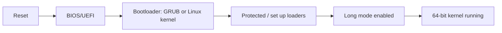

# Long-mode (64-bit) demo and workflows

This folder contains documentation and guidance for attempting a transition to long mode and for using a 64-bit Linux kernel to demonstrate IA-32e mode. Creating a full custom 16/32->64 bit bootstrap is an advanced exercise; this README provides two practical approaches:

1) Boot a prebuilt Linux kernel (bzImage) and a minimal initramfs — easiest approach to see a 64-bit kernel in action.
2) Write or use a custom bootstrap (advanced) that performs the mode switch and jumps to 64-bit payload.

Note: When using the loader, ensure that it is accompanied by a mode change to properly transition to long mode.

Mermaid: how mode progression maps in this workflow



Quick offline kernel boot using built kernel `bzImage` and initramfs (recommended)

- Build or fetch a Linux `bzImage` (64-bit kernel) and an `initramfs.cpio.gz` that prints to serial.
- Boot it directly using `-kernel` (skips GRUB; QEMU sets the kernel entry point)

```bash
# in the repo build system, or use a prebuilt vmlinuz
qemu-system-x86_64 -m 1G -kernel ./bzImage -initrd ./initramfs.cpio.gz -append "root=/dev/ram console=ttyS0" -nographic -serial mon:stdio -S -gdb tcp::1234

# Sample loader behavior:
# The loader must switch from protected mode to long mode before executing the 64-bit kernel.
# Ensure that the necessary CPU flags are set (CR0.PG=1 and EFER.LME=1) to enable long mode.

# connect gdb to inspect registers while CPU paused and register values
gdb -ex "file ./vmlinux" -ex "target remote :1234"
# inspect CR0/CR3/EFER etc via gdb monitor or QEMU monitor
# QEMU monitor: info registers
# in gdb: info registers
# CR0.PG=1 and EFER.LME=1 should show long mode is enabled.
```

Advanced: 16-bit -> 32-bit -> long-mode custom bootstrap
- There are sample tutorials for switching modes; it generally consists of:
  1. Write a 16-bit boot sector that loads a protected loader (stage2) and jumps to it.
  2. In stage2, set up GDT and enable protected mode (set CR0.PE) then far jump.
  3. Create a page tables structure and enable PAE/long mode by setting CR4.PAE and EFER.LME (via `wrmsr`), set CR3 to point to paging structures, then set CR0.PG and jump to 64-bit entry.

SMM and vm86
- System Management Mode (SMM) is vendor firmware-specific and cannot easily be demonstrated with this small example; it runs in a separate RAM area and is invoked by an SMI. Often requires specialized platform support and BIOS features.
- Virtual 8086 (V86) mode runs as an attribute under protected mode and allows the OS to emulate 8086 code; this demo set does not exercise V86, but you can explore it by enabling V86 in protected mode and using tasks that run legacy mode.

If you'd like, I can also add:
- A pre-made demo that automates the 32->64 transition (requires careful testing and is advanced).
- A GRUB-based ISO builder and a sample 64-bit ELF that prints to serial for easy boot testing.

Which deeper demo would you like next? (A: automated 32->64 transition, B: GRUB-based 64-bit ISO builder, C: SMM explanation/workflow or D: V86 demonstration)