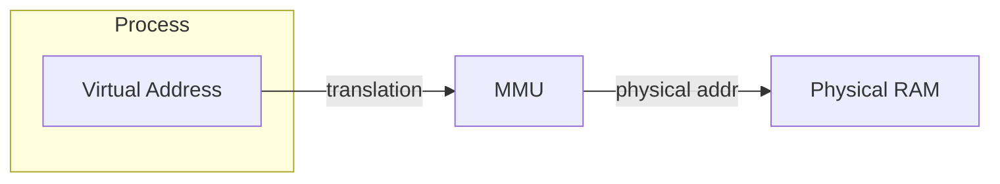
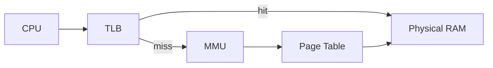
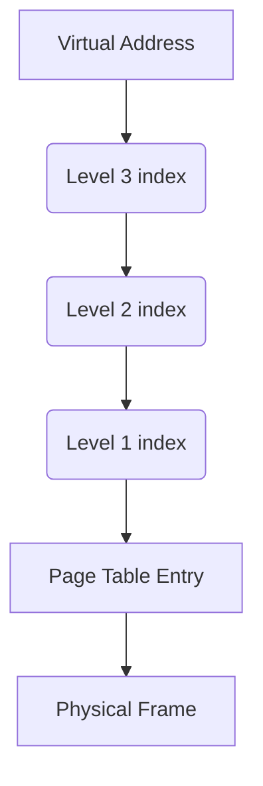
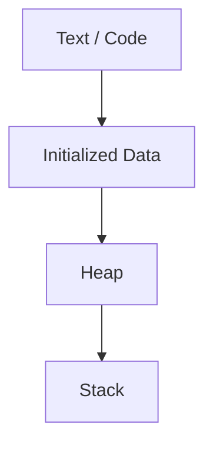
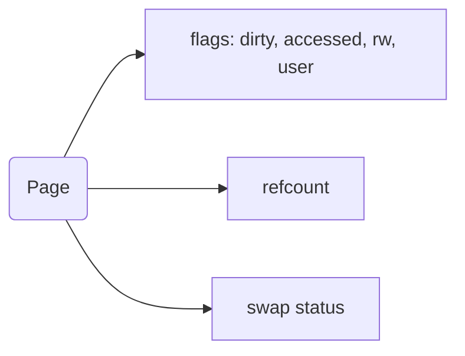
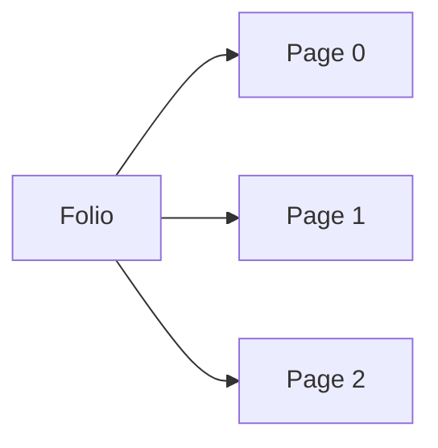
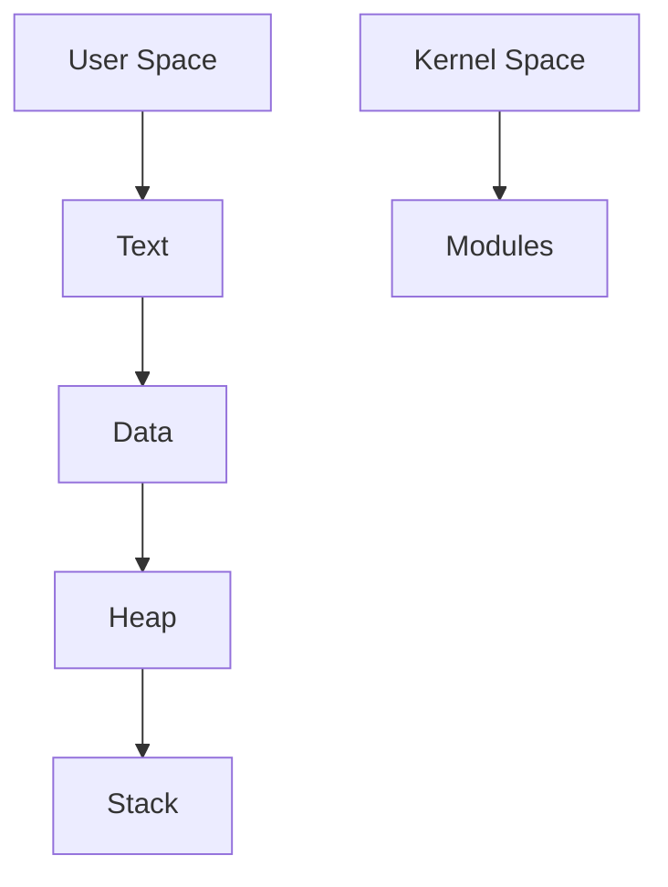

# Memory (Virtual Memory) — Overview

This document describes core concepts used by operating systems to provide virtual memory and manage pages, page tables, translation lookaside buffers (TLBs), and folios (compound pages).

---

## Virtual Memory

Virtual memory gives each process the illusion of a large, contiguous address space independent of physical memory.

Key points:
- Virtual addresses are translated to physical addresses by the MMU.
- Translation relies on page tables and caches (TLB).

---

## Pages

Memory is split into fixed-size pages (e.g., 4 KiB). The OS and CPU translate page-sized virtual blocks to physical frames.

Important fields for a page table entry (PTE) include the PFN (page frame number) and flags (present, rw, user, dirty, accessed).

---

## CPU / TLB

TLB (Translation Lookaside Buffer) is a small, fast cache inside the CPU to speed up address translation.

Notes:
- TLB hits are fast; misses require a page-table walk or walk in hardware.
- Some architectures use multilevel page tables and hardware walks; others need OS intervention.

---

## Page Table

Page tables map virtual pages to physical frames; most systems use multilevel page tables to manage sparse virtual spaces.

Highlights:
- Multilevel tables reduce memory overhead for sparse virtual spaces.
- Each level indexes a portion of the virtual address.

---

## Virtual Memory Area (VMA)

A Virtual Memory Area is a contiguous range of virtual addresses in a process with a single set of permissions and attributes (e.g., code, data, stack, heap).

- Each VMA may correspond to a file mapping, anonymous memory, or machine-provided regions.
- VMAs make memory management policies (like `madvise`, `mprotect`) easier to apply over ranges.

---

## Quick Recap

- Virtual addresses are translated to physical frames using page tables and the MMU.
- Pages are the basic allocation unit; page tables and the TLB provide fast translation.
- VMAs group ranges of virtual addresses for consistent management.

---

## More Page Info

Pages carry metadata beyond mapping — refcounts, migration status, dirty/accessed bits, swap status, and flags like reserved or private.

- Refcount tracks how many holders (mappings, kernel users) refer to a page.
- Dirty/accessed are updated by the hardware or the OS after events.

---

## Compound Pages (Folios)

Compound pages (often called folios in modern kernels) combine several contiguous physical pages into a larger, atomically-managed unit (e.g., for huge pages or internal kernel operations).

- Folios reduce overhead when managing large, contiguous memory regions.
- Useful for huge pages, DMA buffers, or speculative prefetching.

---

## Virtual Memory Address Space (Layout)

A process address space typically has user-space and kernel-space regions with segments (text/data/heap/stack), shared mappings, and mmaps.

- Address layout and exact split depend on ABI and architecture (e.g., x86_64: canonical addresses, 48-bit vs 57-bit).
- ASLR (Address Space Layout Randomization) randomizes mappings to mitigate exploits.

---

## Further reading and links

- Look at your architecture's MMU specification for details (ARM, x86, RISC-V differ in details).
- Kernel sources (e.g., Linux mm layer) show real implementations of VMAs, folios, TLB shootdown, and page reclamation.

> Tip: These short mermaid diagrams are intentionally minimal; expand them per section as you need more depth.
